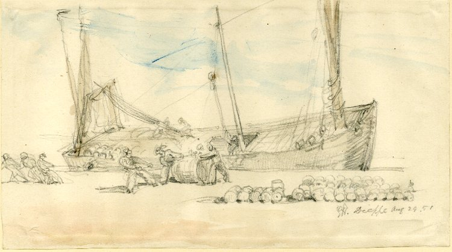

# hatch [](https://travis-ci.org/vlacs/hatch) [](http://coveralls.io/r/vlacs/hatch)

How you get things in and out of the hold.

[](http://commons.wikimedia.org/wiki/File:Unloading_barrels_from_a_ship_at_Dieppe_by_George_Hayter_1851.jpg)

## Usage

### Transacting

*Taken from src/hatch.clj. This outlines how VLACS intends to use
 Hatch, Schematode, and Datomic. To play around, clone hatch, open a
 repl and `(reset)`*

Callers should def their own
[Schematode](https://github.com/vlacs/datomic-schematode) schema:

```clojure
(def schematode-def
  [[:person {:attrs [[:name :string :db.unique/identity]
                     [:favorite-dessert :ref]]}]
   [:dessert {:attrs [[:name :string :db.unique/identity]]
              :part :desserts}]])
```

Callers should def their own partition map:

```clojure
(def partitions {:person :db.part/user
                 :dessert :db.part/desserts})
```

Callers should def their own valid-attrs. Attributes not in this
map will be pruned by tx-clean-entity!

```clojure
(def valid-attrs {:person [:person/name :person/favorite-dessert]
                  :dessert [:dessert/name]})
```

Alternatively, partition maps and valid-attrs can be generated
from your Schematode definition. **Caution! Don't add anything to
your Schematode definition that doesn't belong there! If you are
tempted to do so, you should instead make these by hand!**

```clojure
(def partitions2 (hatch/schematode->partitions schematode-def))

(def valid-attrs2 (hatch/schematode->attrs schematode-def))
```

Callers should def their own tx-entity! fns kinda like this:

```clojure
(def tx-entity! (partial hatch/tx-clean-entity! partitions valid-attrs))
(def tx-entity2! (partial hatch/tx-clean-entity! partitions2 valid-attrs2))
```

Galleon will do this stuff

```clojure
(schematode/init-schematode-constraints! (:db-conn ht-config/system))
(schematode/load-schema! (:db-conn ht-config/system) schematode-def)
```

Callers can then do stuff like this

```clojure
(tx-entity! (:db-conn ht-config/system) :dessert {:dessert/name "ice cream"})
(tx-entity! (:db-conn ht-config/system)
           :person
           {:person/name "Jon"
            :person/favorite-dessert [:dessert/name "ice cream"]})

(tx-entity2! (:db-conn ht-config/system) :dessert {:dessert/name "pie"})
(tx-entity2! (:db-conn ht-config/system)
           :person
           {:person/name "Becky"
            :person/favorite-dessert [:dessert/name "pie"]})
```

### Utilities

Hatch also comes with some other useful functions.

Slam two keywords together to create a single namespaced keyword:

```clojure
user> (hatch/slam :person :name)
:person/name
```

To add a namespace to a single key in a map, use slam-in:

```clojure
user> (hatch/slam-in {:name "Jon" :email "jon@example.com"} :person :name)
{:person/name "Jon", :email "jon@example.com"}
```

Use slam-all to add a namespace to all keys in a map:

```clojure
user> (hatch/slam-all {:name "Jon" :email "jon@example.com"} :person)
{:person/name "Jon", :person/email "jon@example.com"}
```

It's a good idea to use namespaced attributes internally. `slam`,
`slam-in`, and `slam-all` are there when you need it, such as getting
data from an external source.

## License

Copyright © 2014 VLACS http://vlacs.org

Distributed under the Eclipse Public License either version 1.0 or (at
your option) any later version.
